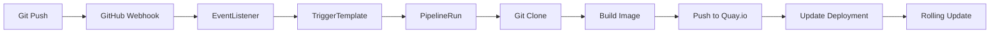

# Tekton CI/CD Pipeline for Bookstore Application

This setup creates a complete CI/CD pipeline using OpenShift Pipelines (Tekton) that automatically builds and deploys your Java Spring Boot application to OpenShift whenever code is pushed to your GitHub repository.

## 🏗️ Architecture

The pipeline includes:
- **Git Clone**: Clones source code from GitHub
- **Build & Push**: Builds container image using Buildah and pushes to Quay.io
- **Deploy**: Updates the OpenShift deployment with the new image
- **GitHub Webhook**: Automatically triggers pipeline on code commits

## 📋 Prerequisites

1. **OpenShift Pipelines Operator** must be installed
2. **Quay.io account** with repository access
3. **GitHub repository** with webhook permissions

## 🚀 Quick Setup

### Option 1: Automated Setup (Recommended)

Run the automated setup script:

```bash
cd tekton/
./setup-pipeline.sh
```

This script will:
- ✅ Check for OpenShift Pipelines operator
- ✅ Create Quay.io authentication secret (interactive)
- ✅ Set up ServiceAccount and RBAC
- ✅ Create the Tekton Pipeline
- ✅ Configure GitHub webhook triggers
- ✅ Provide webhook URL and secret for GitHub configuration

### Option 2: Manual Setup

1. **Install OpenShift Pipelines Operator** (if not already installed):
```bash
oc apply -f - <<EOF
apiVersion: operators.coreos.com/v1alpha1
kind: Subscription
metadata:
  name: openshift-pipelines-operator
  namespace: openshift-operators
spec:
  channel: pipelines-1.15
  name: openshift-pipelines-operator-rh
  source: redhat-operators
  sourceNamespace: openshift-marketplace
EOF
```

2. **Create Quay.io Secret**:
```bash
# Edit 01-quay-secret.yaml with your credentials
oc create secret docker-registry quay-auth-secret \
  --docker-server=quay.io \
  --docker-username=sureshgaikwad \
  --docker-password=YOUR_PASSWORD \
  --docker-email=your-email@example.com \
  -n sgaikwad

oc annotate secret quay-auth-secret tekton.dev/docker-0=https://quay.io -n sgaikwad
```

3. **Apply Pipeline Resources**:
```bash
oc apply -f 02-service-account.yaml
oc apply -f 03-pipeline.yaml
oc apply -f 04-triggers.yaml
oc apply -f 05-github-webhook-secret.yaml
```

4. **Get Webhook URL**:
```bash
oc get route bookstore-webhook-route -n sgaikwad -o jsonpath='{.spec.host}'
```

## 🔧 GitHub Webhook Configuration

After pipeline setup, configure the GitHub webhook:

1. Go to your repository: https://github.com/sureshgaikwad/sample-bookstore-application
2. Navigate to **Settings** > **Webhooks**
3. Click **Add webhook**
4. Configure:
   - **Payload URL**: `https://YOUR_WEBHOOK_URL` (from setup output)
   - **Content type**: `application/json`
   - **Secret**: Use the webhook secret from setup output
   - **Events**: Select "Just the push event"
5. Click **Add webhook**

## 📊 Pipeline Flow



## 🔍 Monitoring

### View Pipeline Runs
```bash
# List all pipeline runs
oc get pipelinerun -n sgaikwad

# Watch a specific pipeline run
oc logs -f pipelinerun/PIPELINE_RUN_NAME -n sgaikwad
```

### View Tekton Dashboard
Access the Tekton Dashboard in the OpenShift Console:
- Navigate to **Pipelines** > **Pipeline Runs**

### Check EventListener Logs
```bash
# Get EventListener pod
oc get pods -l eventlistener=bookstore-event-listener -n sgaikwad

# View logs
oc logs POD_NAME -n sgaikwad
```

## 🛠️ Troubleshooting

### Common Issues

1. **Pipeline fails to start**:
   ```bash
   # Check EventListener status
   oc describe eventlistener bookstore-event-listener -n sgaikwad
   
   # Check webhook route
   oc get route bookstore-webhook-route -n sgaikwad
   ```

2. **Image push fails**:
   ```bash
   # Verify Quay.io secret
   oc get secret quay-auth-secret -n sgaikwad -o yaml
   
   # Check ServiceAccount
   oc describe sa pipeline-service-account -n sgaikwad
   ```

3. **GitHub webhook not triggering**:
   - Verify webhook URL is accessible
   - Check webhook secret matches
   - Ensure GitHub repository has webhook permissions

### Debug Commands

```bash
# View pipeline definition
oc describe pipeline bookstore-ci-pipeline -n sgaikwad

# Check cluster tasks
oc get clustertask | grep -E "(git-clone|buildah|openshift-client)"

# View workspace PVCs
oc get pvc -n sgaikwad

# Check RBAC
oc describe clusterrolebinding pipeline-cluster-role-binding
```

## 🔄 Customization

### Modify Pipeline Parameters

Edit `03-pipeline.yaml` to customize:
- Git repository URL
- Container image name and registry
- Build context and Dockerfile path
- Deployment target

### Add Pipeline Tasks

You can extend the pipeline with additional tasks:
- Code quality checks (SonarQube)
- Security scanning
- Integration tests
- Slack/email notifications

### Example: Add SonarQube Task

```yaml
- name: code-analysis
  taskRef:
    name: sonarqube-scanner
    kind: ClusterTask
  runAfter:
  - git-clone
  params:
  - name: SONAR_HOST_URL
    value: https://your-sonarqube-instance
```

## 📝 Files Description

- `01-quay-secret.yaml`: Docker registry authentication
- `02-service-account.yaml`: ServiceAccount and RBAC permissions
- `03-pipeline.yaml`: Main Tekton Pipeline definition
- `04-triggers.yaml`: GitHub webhook triggers and EventListener
- `05-github-webhook-secret.yaml`: Webhook authentication secret
- `setup-pipeline.sh`: Automated setup script

## 🏁 Success Criteria

After successful setup:
- ✅ Pipeline appears in OpenShift Console
- ✅ EventListener pod is running
- ✅ Webhook route is accessible
- ✅ GitHub webhook shows recent deliveries
- ✅ Code push triggers automatic build and deployment

## 🔗 References

- [OpenShift Pipelines Documentation](https://docs.openshift.com/container-platform/latest/cicd/pipelines/understanding-openshift-pipelines.html)
- [Tekton Documentation](https://tekton.dev/docs/)
- [Quay.io Documentation](https://docs.quay.io/)
- [GitHub Webhooks Guide](https://docs.github.com/en/developers/webhooks-and-events/webhooks)
